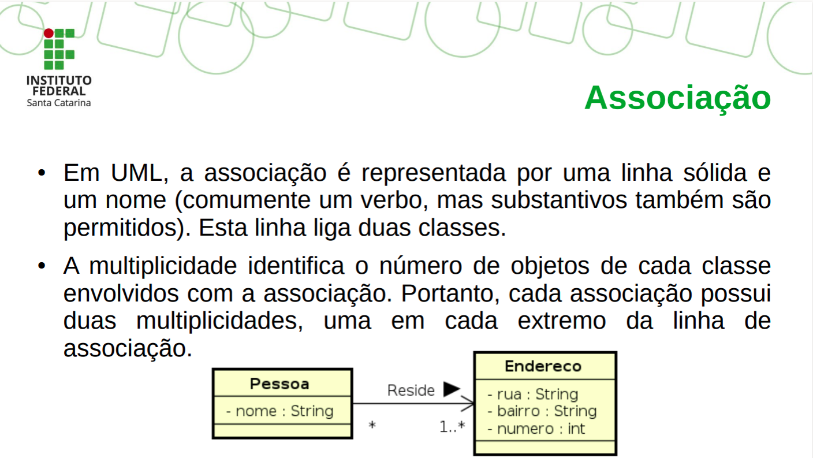
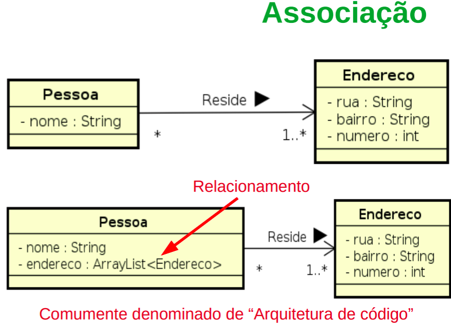
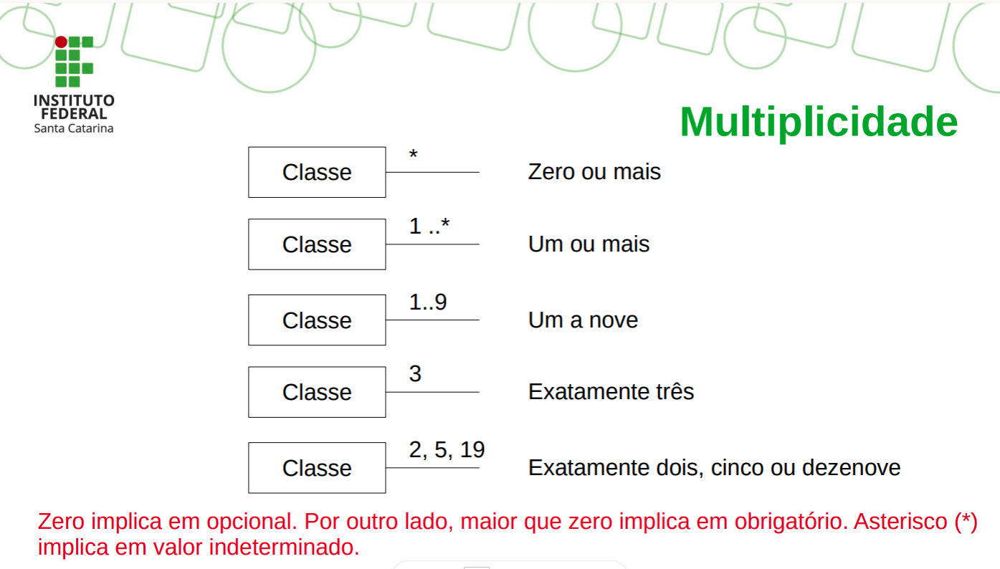
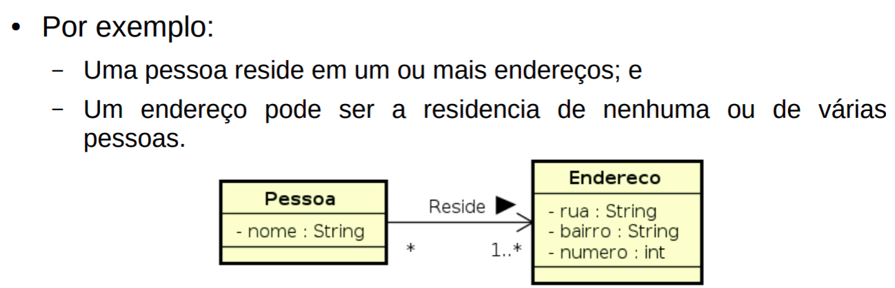
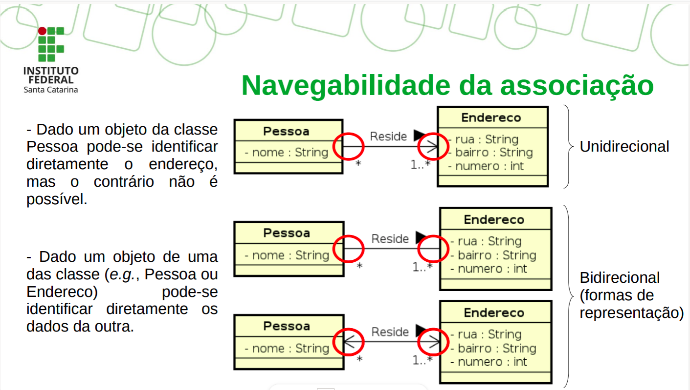
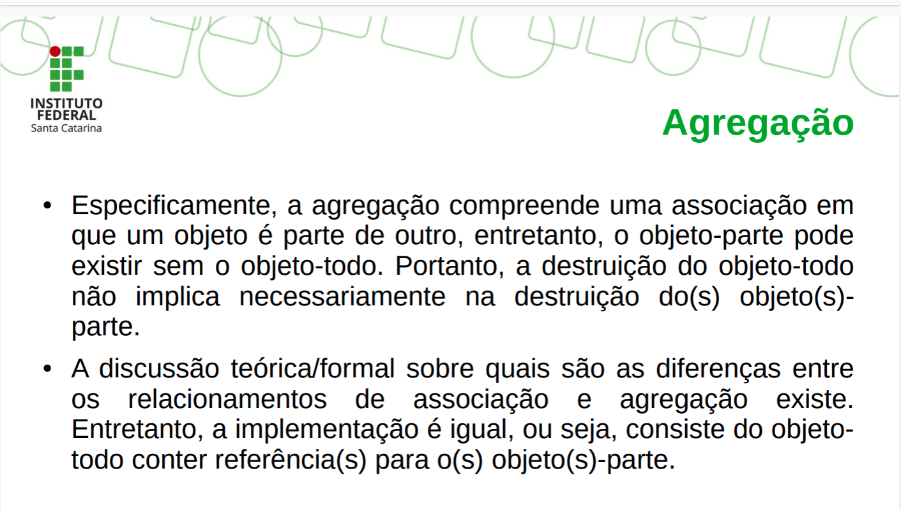
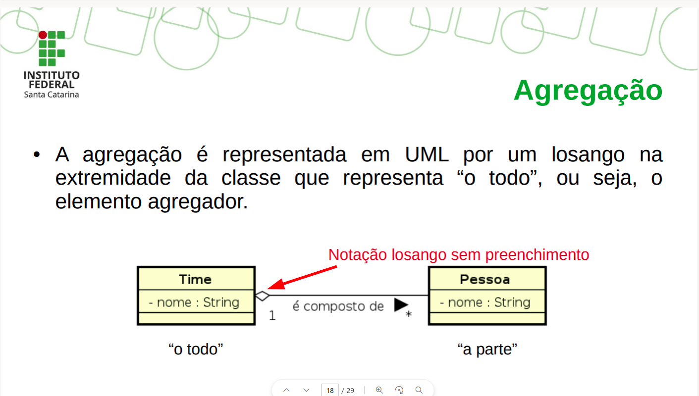
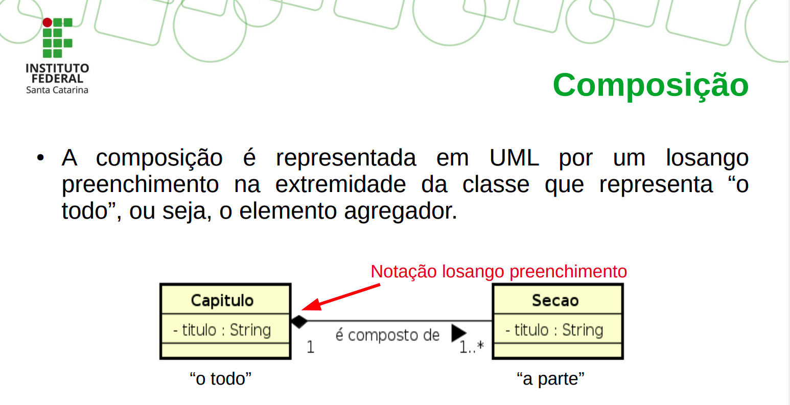
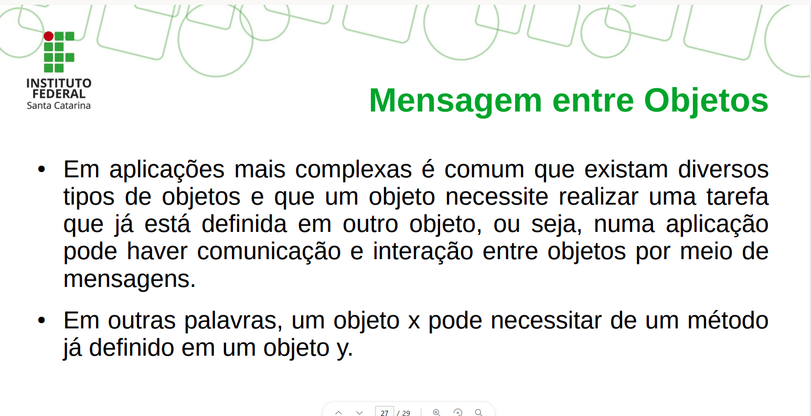
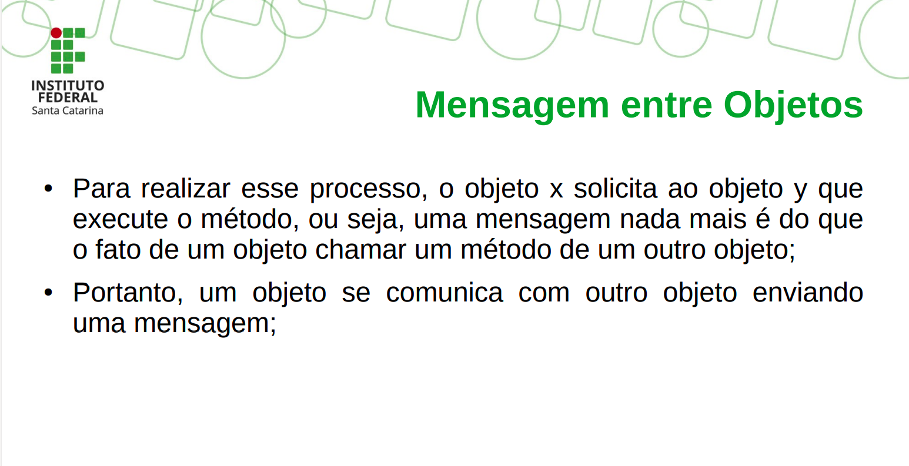

# SEMANA 3 - Conteúdo
## Relacionamento

- O relacionamento entre duas entidades (classes/objetos) representa a ligação lógica entre os mesmos.
- Os principais tipos de relacionamento são:
- - Associação (classes conectadas entre si) -> Agregaçaõ/composição
  - Dependência (uma classe depende ou usa a outra)
  - Generalização/Especialização (Herança)
  - Realização (Implementação de Uma interface)

### Associação


---
#### Representando

#### Multiplicidade


#### Navegabilidade

#### Exemplo de implementação
Classe Main
```java
public class Main{
    public static void main(String[] args){
        Endereco e = new Endereco();
        Pessoa p1 = new Pessoa();
        Pessoa p2 = new Pessoa();
    }
}
```
Classe Pessoa

````java
import java.util.List;

public class Pessoa {
    private String nome;
    private List<Endereco> endereco = new ArrayList<>();

    public Pessoa(String nome, Endereco endereco) {
        this.nome = nome;
        this.endereco.add(endereco);
    }
}
````
Classe Endereco
````java
public class Endereco{
    private String bairro;
    private String rua;
    private int numero;
}
````
---
### Agregação/Composição
- Tipo especial de associação

Na associação temos que as classes se encontram no mesmo nível conceitual.
Já a agregação/composição implica que uma classe presica ser complementada por outra classe.

Portanto representam uma relação todo-parte:
- Objeto-todo;
- Objeto-parte.

Palavras-chave de associação:
- tem um;
- é parte de;
- consiste em;
- contém;
- é;
- possui;
- é composta de;
- faz parte de.

#### Falando de Agregação



#### Exemplo de implementação

Classe Main
````java
public class Main {
    public static void main(String[] args) {
        Pessoa p1 = new Pessoa();
        Pessoa p2 = new Pessoa();
        Time t = new Time();
        t.setPessoa(p1);
        t.setPessoa(p2);
    }
}
````
Classe Time

````Java
import java.util.ArrayList;

public class Time {
    private String nome;
    private ArrayList<Pessoa> pessoa = new ArrayList<Pessoa>();
    public void setPessoa(Pessoa pessoa){
        this.pessoa.add(pessoa);
    }
}
````
Classe Pessoa

````java
public class Pessoa{
    private String nome;
}
````

### Composição

Nesse caso temos uma associação em que o objeto-todo
é responsável pela disposição dos objetos-parte. Portanto
o objeto-todo é responsável pela criação e destruição dos
objetos-parte.



#### Exemplo de implementação
Classe Main
````java
public class Main{
    public static void main(String[] args) {
        Capitulo t = new Capitulo("obj");
        t.setSecao("Outra seção");
    }
}
````
Classe Capitulo
````java
import java.util.ArrayList;

public class Capitulo {
    private String titulo;
    private ArrayList<Secao> secao = new ArrayList<Secao>();
    public Capitulo(String titulosecao){
        this.secao.add(new Secao(titulo));
    }
    public void setSecao(String titulo){
        this.secao.add(new  Secao(titulo));
    }
}
````
Classe Secao
````java
public class Secao{
    private String titulo;
    public Secao(String titulo){
        this.titulo = titulo;
    }
}
````
### Mensagem entre Objetos

